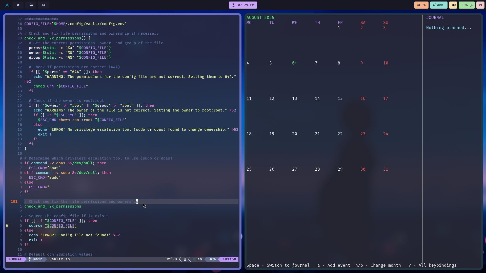

<h1 align="center">Hi, I'm rhjddjdbe</h1>
<h3 align="center">DevOps · Linux · IT Security · Reverse Engineering</h3>

  Passionate about low-level tooling, security, and automation. 
  Building CLI tools with Bash and C. 
  Learning x86-64 Assembly. 
  Writing at <a href="https://rhjddjdbc.github.io/blog/">rhjddjdbc.github.io/blog</a>

---

## Languages & Tools

  
  
  
  
  

---

## Projects

- [**VaultX**](https://github.com/rhjddjdbc/vaultx) – CLI password manager with AES-256 encryption, breach check, and HMAC logging.
- [**eba**](https://github.com/rhjddjdbc/eba) – ELF Binary Analyzer: headers, entropy, disassembly, strings, symbols.
- [**Crawldork**](https://github.com/rhjddjdbc/crawldork) – A Bash tool for URL discovery and local mirroring with sitemap support and optional JS rendering.
- [**Revers-shell**](https://github.com/rhjddjdbc/Revers-shell) – Stealthy Bash reverse shell using GPG encryption and SSH remote port forwarding.
- [**arch-hardend**](https://github.com/rhjddjdbc/arch-hardend) – Arch Linux hardening script using AppArmor, audit, AIDE.
- [**viscan**](https://github.com/rhjddjdbc/viscan) – Lightweight malware scanner using ClamAV signature databases (.hdb/.cdb/.ldb/.mdb).
- [**dotfiles**](https://github.com/rhjddjdbc/dotfiles) – SwayFX-based Wayland desktop setup with Neovim and Kitty/Foot.

  

---

  <a href="https://github.com/rhjddjdbc/meme"><strong>Memes</strong></a>

